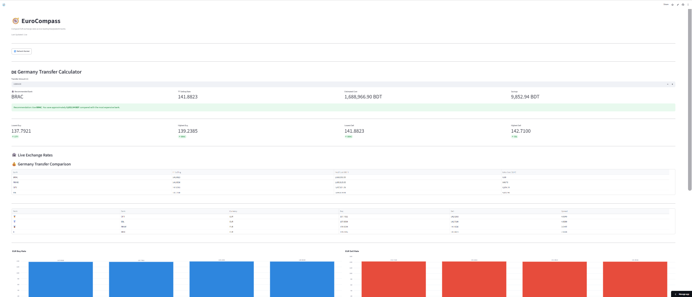
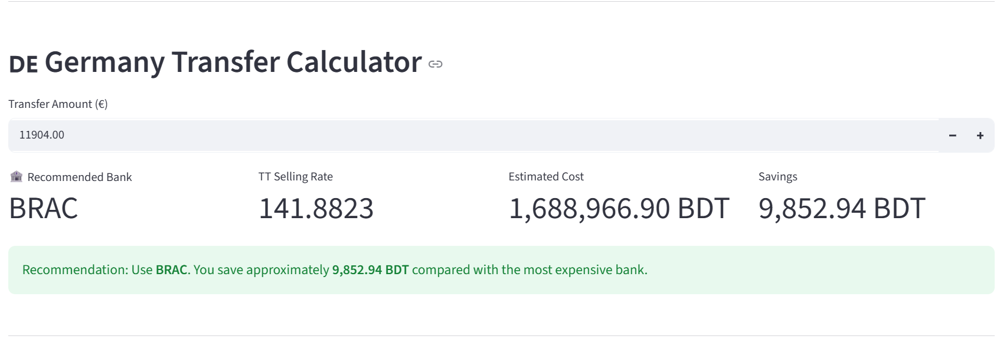
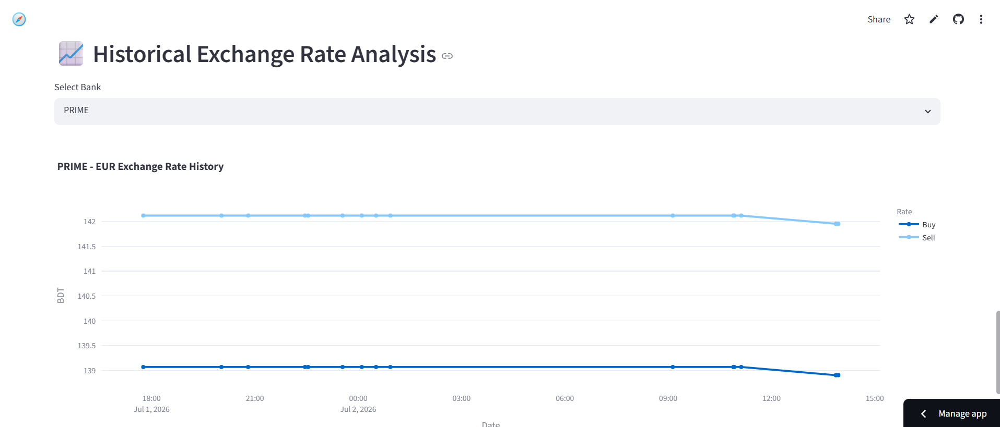
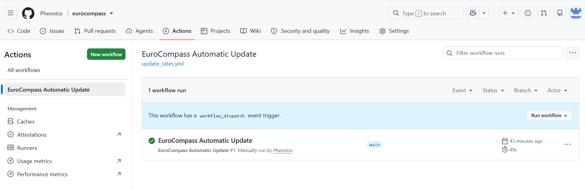

# 🧭 EuroCompass

> **A cloud-powered financial intelligence platform for comparing EUR exchange rates across Bangladeshi banks.**

EuroCompass automatically collects live EUR exchange rates, tracks historical trends, recommends the most cost-effective bank for international transfers, and updates itself every hour using GitHub Actions.

---

## 🚀 Live Demo

**Dashboard:** https://eurocompass.streamlit.app

---

## ✨ Key Features

- 💶 Live EUR exchange rates from multiple Bangladeshi banks
- 📈 Historical exchange-rate tracking
- 🏦 Intelligent bank recommendation engine
- 💸 Germany transfer cost calculator
- 📊 Interactive Streamlit dashboard
- ☁️ Automatic hourly updates with GitHub Actions
- 📂 GitHub-based historical storage (no database required)
- 🤖 Telegram bot integration

## 📸 Screenshots

### Dashboard Overview



### Transfer Calculator



### Historical Analysis



### Automated Updates



## 🎯 Why EuroCompass?

Students and professionals sending money from Bangladesh to Europe often compare exchange rates across multiple banks.

EuroCompass automates this process by:

- Collecting live EUR exchange rates
- Comparing transfer costs
- Recommending the lowest-cost bank
- Tracking historical trends over time
- Providing a public dashboard for easy analysis

Instead of manually checking multiple banking websites, users can make informed financial decisions using a single platform.

## 🏗️ System Architecture

```text
                    ┌─────────────────────┐
                    │ Bangladeshi Banks   │
                    │ BRAC • CITY • EBL • PRIME
                    └──────────┬──────────┘
                               │
                               ▼
                     Python Collectors
                               │
                               ▼
                  Data Processing & Analysis
                               │
             ┌─────────────────┴─────────────────┐
             ▼                                   ▼
     Latest Market Snapshot              Historical CSV Files
             │                                   │
             ▼                                   ▼
      Streamlit Dashboard              GitHub Repository
             ▲                                   ▲
             └───────────────┬───────────────────┘
                             │
                             ▼
                  GitHub Actions (Hourly)
```

### Data Flow

1. Collect live EUR exchange rates from supported banks.
2. Process and validate exchange-rate data.
3. Export the latest market snapshot.
4. Update historical CSV files stored in GitHub.
5. Automatically refresh the Streamlit dashboard.
6. Recommend the most cost-effective bank for transfers.

## 🛠️ Technology Stack

| Category | Technology |
|----------|------------|
| Language | Python 3.12 |
| Dashboard | Streamlit |
| Charts | Plotly |
| Data Processing | Pandas |
| Web Requests | Requests |
| Web Scraping | BeautifulSoup |
| Automation | GitHub Actions |
| Version Control | Git & GitHub |
| Environment Management | python-dotenv |
| Notifications | Telegram Bot API |
| Data Storage | CSV + GitHub Repository |

## ⚙️ Installation

Clone the repository:

```bash
git clone https://github.com/Pheonicx/eurocompass.git
cd eurocompass
```

Create a virtual environment:

```bash
python -m venv .venv
```

Activate it:

### Windows

```bash
.venv\Scripts\activate
```

### Linux / macOS

```bash
source .venv/bin/activate
```

Install dependencies:

```bash
pip install -r requirements.txt
```

## 🔑 Configuration

Create a `.env` file in the project root.

```env
GITHUB_TOKEN=your_personal_access_token
GITHUB_USERNAME=your_github_username
GITHUB_REPO=your_repository_name
TELEGRAM_BOT_TOKEN=your_telegram_bot_token
```

> **Note:** Never commit your `.env` file. It is already excluded by `.gitignore`.

## ▶️ Usage

### Collect Live Exchange Rates

Run:

```bash
python main.py
```

This will:

- Collect the latest EUR exchange rates
- Calculate market statistics
- Export the latest snapshot
- Update historical CSV files
- Synchronize history with GitHub

---

### Launch the Dashboard

```bash
streamlit run dashboard/app.py
```

Then open:

```
http://localhost:8501
```

---

### Automatic Updates

EuroCompass uses **GitHub Actions** to automatically run every hour.

Each run:

- Collects fresh exchange rates
- Updates historical data
- Pushes changes to GitHub
- Keeps the Streamlit dashboard up to date

## 📁 Project Structure

```text
EuroCompass/
│
├── collectors/          # Bank-specific collectors
├── config/              # Configuration
├── dashboard/           # Streamlit dashboard
├── data/                # Latest market data
├── history/             # Historical CSV files
├── services/            # Shared services
├── telegram_bot/        # Telegram bot
├── utils/               # Helper modules
│
├── .github/
│   └── workflows/
│       └── update_rates.yml
│
├── main.py
├── requirements.txt
└── README.md
```

## 🗺️ Roadmap

### ✅ Version 1.0

- Live exchange-rate collectors
- Historical tracking
- Interactive dashboard
- Germany transfer calculator
- GitHub Actions automation
- Telegram bot integration

### 🚀 Future Improvements

- Additional currencies (USD, GBP, etc.)
- Exchange-rate forecasting
- Trend and volatility analysis
- Personalized alerts
- Enhanced dashboard analytics

## 📄 License

This project is licensed under the **MIT License**.

See the `LICENSE` file for details.

## 🙏 Acknowledgements

Thanks to the official banking websites and publicly available exchange-rate information that make this project possible.

This project was built as a learning exercise in software engineering, automation, and financial data analysis.